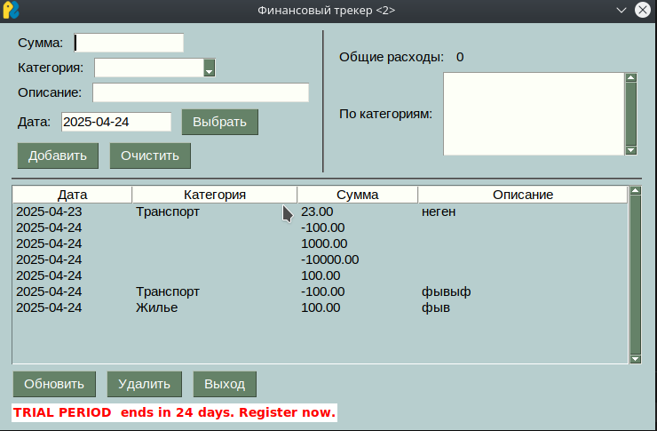

# Лабораторная работа 8

Реализуйте приложение с GUI (приложения-игры допускается делать с использованием TUI-пакетов) по своему варианту. Можно изменить задание на собственную тему, согласовав с преподавателем. Требования:

    приложение должно быть написано с применением ОО парадигмы
    исключительные ситуации должны обрабатываться с использованием собственных исключений
    GUI/TUI фреймворки не должны повторяться в группе

    Финансовый трекер расходов.

В коде я сделал
Программу которая представляет собой финансовый трекер, который использует принципы объектно-ориентированного программирования (ООП) для обеспечения модульности и удобства работы с расходами и доходами. Используемые концепции, такие как инкапсуляция, полиморфизм, абстракция, позволяют легко расширять функциональность и поддерживать код. Через GUI пользователь может добавлять, удалять и отслеживать свои расходы, а также просматривать статистику по категориям и общую сумму расходов.

# Список литературы

[Парадигмы и стили программирования Python: обзор и пример](https://sky.pro/wiki/python/paradigmy-i-stili-programmirovaniya-python-obzor-i-primery/)

[Объектно-ориентированное программирование Классы и объекты](https://metanit.com/python/tutorial/7.1.php)

