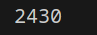
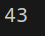
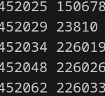

задание 1
Настя составляет 6-буквенные коды из букв Н, А, С, Т, Я. Каждая допустимая гласная буква может входить в код не более одного раза. Сколько кодов может составить Настя?

Генерируем все возможные коды длины 6 с itertools.product().
Считаем буквы 'А' и 'Я' в каждом коде.
Фильтруем коды, оставляя только те, где 1 'А' и 1 'Я'.
Подсчитываем количество таких кодов и выводим результат.
задание 2
Значение арифметического выражения 1618 ⋅ 410−46−16 16^{18} · 4^{10} − 46 − 16 1618 ⋅ 410−46−16  записали в системе счисления с основанием 4. Сколько цифр 3 содержится в этой записи?

Программа вычисляет выражение, переводит его в систему счисления с основанием 4 и считает количество цифр '3' в записи.
задание 3
    Пусть MMM  — сумма минимального и максимального натуральных делителей целого числа, не считая единицы и самого числа. Если таких делителей у числа нет, то считаем значение M равным нулю. Найдите целые числа, большие 452 021, в порядке возрастания, такие, для которых значение MMM при делении на 7 даёт в остатке 3. Вывести первые 5 найденных чисел и соответствующие им значения MMM.

    Формат вывода: для каждого из 5 таких найденных чисел в отдельной строке сначала выводится само число, затем  — значение MMM. Строки выводятся в порядке возрастания найденных чисел.

 Например, для числа 20: M  =  2 + 10  =  12 M  =  2 + 10  =  12 M  =  2 + 10  =  12, остаток при делении на 7 не равен 3; для числа 21: M  =  3 + 7  =  10 M  =  3 + 7  =  10 M  =  3 + 7  =  10, остаток при делении на 7 равен 3.

Перебираем числа от 452022.
Находим их делители (кроме 1 и самого числа).
Считаем M = min + max.
Проверяем M % 7 == 3, если да → выводим число и M.
Повторяем, пока не найдём 5 чисел.
