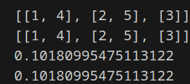

# Лабораторная работа 3
Функция для преобразования вложенных списков в строку:

$>>> to_str([1, [2, [3, [4, [5]]]]])
'1 -> 2 -> 3 -> 4 -> 5 -> None'$
    
    Функция для расчёта $ai=ai−2+ai−12i−1 a_i = a_{i-2} + \frac{a_{i-1}}{2^{i-1}} ai​=ai−2​+2i−1ai−1​​. a0=a1=1 a_0 = a_1 = 1 a0​=a1​=1$
   
Итеративная версия:
Использован цикл for и функция enumerate для распределения элементов.
Эффективна по времени и памяти.

Рекурсивная версия (с result):
Использована рекурсия с передачей промежуточного результата (result) как аргумента.
Эффективна, но менее "чистая" из-за изменяемого аргумента.

Рекурсивная версия (без result):
Создаётся новый список на каждом шаге рекурсии.
Итеративная версия:
Использован цикл for и функция enumerate для распределения элементов.
Эффективна по времени и памяти.

Рекурсивная версия (с result):
Использована рекурсия с передачей промежуточного результата (result) как аргумента.
Эффективна, но менее "чистая" из-за изменяемого аргумента.

Рекурсивная версия (без result):
Создаётся новый список на каждом шаге рекурсии.

# Список литературы
https://youtu.be/IJDJ0kBx2LM

https://proglib.io/p/samouchitel-po-python-dlya-nachinayushchih-chast-13-rekursivnye-funkcii-2023-01-23

https://habr.com/ru/articles/337030/

