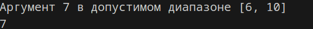
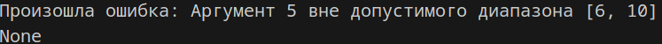

# Лабораторная работа 4

Задание 1

Замыкание, определяющее нахождение аргуметов в допустимых диапазонах.
```python
def range_closure(min_val, max_val):
    def inner(x):
        if x < min_val or x > max_val:
            raise ValueError(f"Аргумент {x} вне допустимого диапазона [{min_val}, {max_val}]")
        elif x > min_val or x < max_val:    
            print(f"Аргумент {x} в допустимом диапазоне [{min_val}, {max_val}]")
        return x 
    return inner 
```
Замыкание `range_closure` создает функцию, которая проверяет, входит ли число в заданный диапазон. Если число в диапазоне — выводит сообщение и возвращает его. Если число вне диапазона — выбрасывает ошибку.



Задание 2

Декоратор, который будет оборачивать каждую функцию в try блок для обработки ошибок.
```python
def error_handler_decorator(func):
    def wrapper(*args, **kwargs):
        try:
            return func(*args, **kwargs)
        except Exception as e:
            print(f"Произошла ошибка: {e}")
            return None  #
    return wrapper
```
Декоратор error_handler_decorator оборачивает функцию в try, чтобы перехватывать ошибки. Если ошибка возникает, 
он выводит сообщение об ошибке и возвращает None. Если ошибок нет — возвращает результат функции.



Список литературы

[Замыкания в Python: примеры использования](https://habr.com/ru/articles/862692/)

[Декораторы | Python: Функции - Хекслет](https://ru.hexlet.io/courses/python-functions/lessons/decorators/theory_unit)
