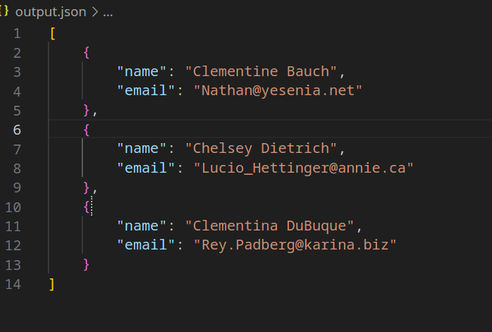

# Лабораторная работа 5
Задание

Генератор, который обращается к внешнему API и возвращает результаты запросов. Накопите результаты за определённый промежуток времени и сохраните в файл.
```python
import requests
import json

# Генератор для получения данных с API
def fetch_data_from_api(api_url, page_limit=3):
    for page in range(1, page_limit + 1):  # Получаем данные с нескольких страниц
        url = f"{api_url}?_page={page}"
        response = requests.get(url)  # Делаем запрос к API
        if response.status_code == 200:  # Если запрос успешен
            yield response.json()  # Возвращаем данные
        else:
            print(f"Ошибка при запросе: {response.status_code}")
            break

# Функция для обработки данных
def process_data(data):
    # Фильтруем пользователей, чьи имена начинаются с 'C'
    filtered_data = filter(lambda x: x['name'].startswith('C'), data)
    
    # Извлекаем имена и email этих пользователей
    mapped_data = map(lambda x: {'name': x['name'], 'email': x['email']}, filtered_data)
    
    # Возвращаем обработанные данные как список
    return list(mapped_data)

# Сохраняем данные в файл
def save_to_file(data, filename="output.json"):
    with open(filename, 'w') as file:
        json.dump(data, file, indent=4)

# Основная функция
def main():
    api_url = "https://jsonplaceholder.typicode.com/users"
    
    # Собираем данные с нескольких страниц API
    collected_data = []
    for data in fetch_data_from_api(api_url):
        collected_data.extend(data)  # Добавляем данные с каждой страницы
    
    # Обрабатываем собранные данные
    processed_data = process_data(collected_data)
    
    # Сохраняем обработанные данные в файл
    save_to_file(processed_data)
    print(f"Обработанные данные сохранены в файл 'output.json'.")

if __name__ == "__main__":
    main()
    x=fetch_data_from_api("https://jsonplaceholder.typicode.com/users")
    print (next(x))
    print(type(x))
```


Отчет:


1. **Создал генератор `fetch_data_from_api`** для получения данных с API (постранично, 3 страницы).  
2. **Обработал данные в `process_data`**:  
   - Отфильтровал пользователей с именами на букву **'C'**.  
   - Оставил только их имена и email.  
3. **Сохранил результат в JSON-файл** (`output.json`).  

Итог: Скрипт собирает, фильтрует и сохраняет данные пользователей с API.



# Список литературы
[Генераторы Python: что это такое и зачем они нужны](https://skillbox.ru/media/code/generatory_python_chto_eto_takoe_i_zachem_oni_nuzhny/)

[Функция map() в Python: зачем нужна и как ей пользоваться](https://skillbox.ru/media/code/funkciya-map-v-python-zachem-nuzhna-i-kak-ey-polzovatsya/)

[Понимание функции reduce() в Python](https://ya.zerocoder.ru/pgt-ponimanie-funkcii-reduce-v-python/)

[Как работает функция filter() в Python](https://timeweb.cloud/tutorials/python/kak-rabotaet-funkciya-filter-v-python)