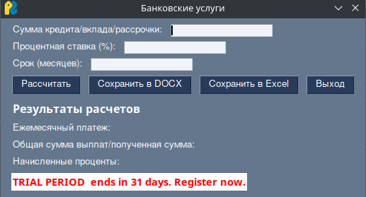

# Лабораторная работа 6
 Задание 
 Банковские услуги

    Кредит
    Рассрочка
    Вклад

Расчёт процентов, графика платежей.

Фреймворк PySimpleGUI
~~~python
import PySimpleGUI as sg
from bank_services import calculate_credit, calculate_deposit, calculate_installment
from doc_report import create_doc_report
from excel_report import create_excel_report

# Разметка интерфейса
layout = [
    [sg.Text("Сумма кредита/вклада/рассрочки:"), sg.InputText(key='-AMOUNT-', size=(20,1))],
    [sg.Text("Процентная ставка (%):"), sg.InputText(key='-RATE-', size=(20,1))],
    [sg.Text("Срок (месяцев):"), sg.InputText(key='-MONTHS-', size=(20,1))],
    
    [sg.Button("Рассчитать"), sg.Button("Сохранить в DOCX"), sg.Button("Сохранить в Excel"), sg.Button("Выход")],
    
    [sg.Text("Результаты расчетов", size=(30, 1), font='Any 12 bold')],
    [sg.Text("Ежемесячный платеж: "), sg.Text("", key='-MONTHLY_PAYMENT-')],
    [sg.Text("Общая сумма выплат/полученная сумма: "), sg.Text("", key='-TOTAL_PAYMENT-')],
    [sg.Text("Начисленные проценты: "), sg.Text("", key='-INTEREST_EARNED-')]
]

window = sg.Window("Банковские услуги", layout)

# Основной цикл программы
while True:
    event, values = window.read()
    
    if event == sg.WINDOW_CLOSED or event == "Выход":
        break
    
    if event == "Рассчитать":
        try:
            amount = float(values['-AMOUNT-'])
            rate = float(values['-RATE-'])
            months = int(values['-MONTHS-'])

            # Вычисление результатов
            credit_result = calculate_credit(amount, rate, months)
            deposit_result = calculate_deposit(amount, rate, months)

            # Обновление GUI с результатами
            window['-MONTHLY_PAYMENT-'].update(f"{credit_result[0]:.2f} руб.")
            window['-TOTAL_PAYMENT-'].update(f"{credit_result[1]:.2f} руб.")
            window['-INTEREST_EARNED-'].update(f"{deposit_result[1]:.2f} руб.")
        
        except ValueError:
            sg.popup_error("Введите корректные данные!")

    if event == "Сохранить в DOCX":
        create_doc_report(credit_result, deposit_result)
        sg.popup("Отчет сохранен в формате DOCX!")

    if event == "Сохранить в Excel":
        create_excel_report(credit_result, deposit_result)
        sg.popup("Отчет сохранен в формате Excel!")

window.close()
```


