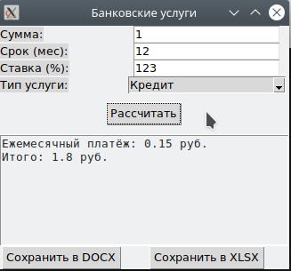

# Лабораторная работа 7

Перепишите свой вариант ЛР №6 с использованием классов и объектов. Задание то же, вариант GUI фреймворка возьмите следующий по списку. Для успешной сдачи в коде должны присутствовать:

    использование абстрактного базового класса и соотвествующих декораторов для методов,
    иерархия наследования,
    managed - атрибуты,
    минимум 2 dunder-метода у каждого класса.

Программа реализует расчёты для банковских услуг, таких как кредит, рассрочка и вклад, с использованием принципов ООП и функционала для сохранения результатов в отчёты. Все расчёты выполняются через абстрактный базовый класс BankService, от которого наследуются конкретные классы для каждой услуги.
Для абстракции используется @abstractmethod для метода calculate(), который реализуют все наследники. В классе BankService определены managed-атрибуты с помощью @property для контроля доступа к вычисляемым данным, как, например, ежемесячный платёж для кредита.
Каждый класс реализует два dunder-метода: __str__ для строкового представления и repr для более формального представления объекта, что упрощает вывод информации.
Интерфейс программы построен с использованием tkinter, обеспечивая удобный ввод данных и отображение результатов. Программа позволяет сохранить результаты расчётов в отчёты форматов .docx (с помощью python-docx) и .xlsx (с помощью openpyxl).
Классы кредит, рассрочка и вклад реализуют расчёты по собственным формулам и сохраняют результаты, предоставляя пользователю возможность вывести отчёт.
Это решение демонстрирует использование ООП с наследованием и абстракцией, а также интеграцию с библиотеками для работы с файлами и создания графического интерфейса.

# Список литературы

[Dunder-методы: зачем они нужны и что могут](https://tproger.ru/articles/dunder-metody-zachem-oni-nuzhny-i-chto-mogut)

[Абстрактные классы и интерфейсы: 7‑я часть гайда по ООП](https://skillbox.ru/media/code/oop_chast_6_abstraktnye_klassy_i_interfeysy/)

[Python Property: A Guide to Managed Attributes](https://canardanalytics.com/blog/python-property-decorator/)