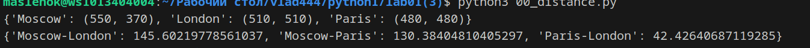
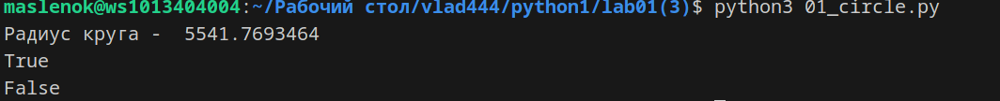
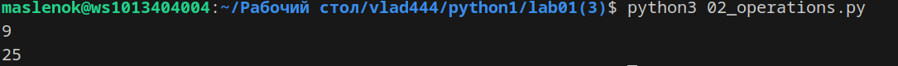
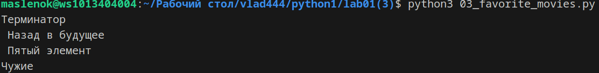
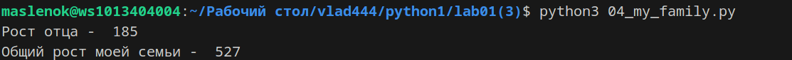
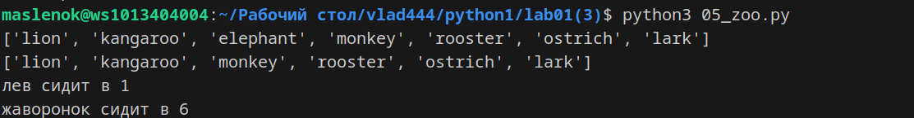
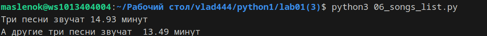
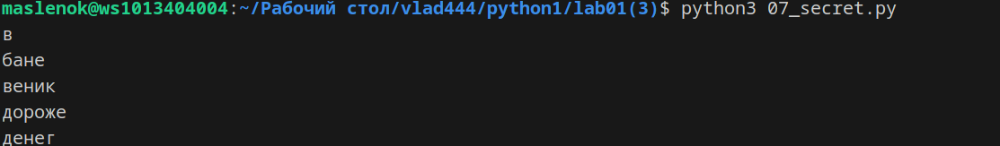
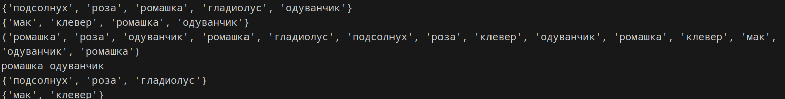
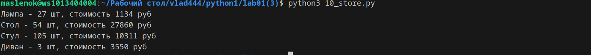

# Лабораторная работа №1 
# 1. Словарь координат городов
sites = {

    'Moscow': (550, 370),

    'London': (510, 510),

    'Paris': (480, 480),

}


Составим словарь словарей расстояний между ними расстояние на координатной сетке 

((x1 - x2) ** 2 + (y1 - y2) ** 2) ** 0.5 - формула для расчетов.


*Я создал словарь с каждым городом,(Не учитывал расстояния между городом и им самим) после внутри словаря сделал словарь к каждому городу и рассчитал расстояние по формуле:* 
	



# 2. Значение радиуса круга


radius = 42


Далее, пусть есть координаты точки
point_1 = (23, 34)
где 

23 - координата х, 

34 - координата у


Если точка point лежит внутри того самого круга центр в начале координат (0, 0), radius = 42,
то выведите на консоль True, Или False, если точка лежит не в кругу.


*Я нашел площадь круга с точностью до 4-х знаков, проверил лежат ли точки внутри круга:*




# 3. Расставьте знаки операций "+", "-", "*" и скобки ;)
Между числами "1 2 3 4 5" нужно расставить знаки так, что бы получилось число "25".


*Расставил знаки в правильном порядке и получилось вот такое чудо:*




# 4. Cтрока с перечислением фильмов
my_favorite_movies = 'Терминатор, Пятый элемент, Аватар, Чужие, Назад в будущее'


Выведите на консоль с помощью индексации строки, последовательно:
первый фильм
последний
второй
второй с конца


*Вывел в консоль эти шедевры кинематографа с помощью индексации:*




# 5. Нет ничего важнее семьи  -  *Доменик с Торента*

  Нужно создать список семьи, после сделать список списков роста членов семьи, а после вывести рост отца и общий рост всей семьи.

*Создал список семьи, сделал список списков роста, а после вывел рост отца и общий рост семьи:*





# 6. Зоопарк
Был список животных в зоопарке, нужно было посадить медведя между львом и кенгуру, а после вывести на консоль. После добавить птиц в последние клетки зоопарка и вывести список, убрать слона, вывести список повторно и в конце вывести в какой клетки сидит лев и жаворонок:


*Выполнил все по заданию, распределил всё зверье и получилось вот так:*




# 7. Музло дико качает
Есть список песен группы Depeche Mode со временем звучания с точностью до долей минут распечатайте общее время звучания трех песен: 'Halo', 'Enjoy the Silence' и 'Clean' в формате
	Три песни звучат ХХХ.XX минут
и распечатайте общее время звучания трех песен: 'Sweetest Perfection', 'Policy of Truth' и 'Blue Dress'
	А другие три песни звучат ХХХ минут


 
 *Выполнил всё по заданию, получились вот такие тайминги:*



# 8. Шифр баньшику 

Есть зашифрованное сообщение. Нужно его расшифровать и вывести на консоль в удобочитаемом виде. Должна получиться фраза на русском языке, например: как два байта переслать.


*Расшифровал и вывел на консоль цитату великих:*




# 9. Цветочки

В саду и лугу сорвали цветы, нужно было вывести множество этих цветов, все виды которые растут и там и там, которые растут в саду, но не растут на лугу, которые растут на лугу, но не растут в саду.

Вывел множество цветов и еще много текста всякого:




# 10. Cловарь магазинов с распродажами 

Нужно создать словарь цен на продукты

*Создал словарь цен на продукты:*


 # 11. Склады ИКЕЯ
 Есть словарь кодов товаров и есть словарь списков количества товаров на складе. Рассчитать на какую сумму лежит каждого товара на складе и вывести стоимость каждого вида товара на складе.

*Рассчитал стоимость каждого вида товара на складе и вывел стоимость каждого:*




# Шпора по Git:
### Шпаргалка по основным командам Git

#### 1. **Настройка Git**
- **Установить имя пользователя:**  
  ```bash
  git config --global user.name "Ваше Имя"
  ```
- **Установить email:**  
  ```bash
  git config --global user.email "ваш.email@example.com"
  ```
- **Просмотр настроек:**  
  ```bash
  git config --list
  ```

#### 2. **Создание и клонирование репозиториев**
- **Инициализация нового репозитория:**  
  ```bash
  git init
  ```
- **Клонирование существующего репозитория:**  
  ```bash
  git clone <URL репозитория>
  ```

#### 3. **Работа с изменениями**
- **Проверить статус репозитория:**  
  ```bash
  git status
  ```
- **Добавить файлы в индекс (staging area):**  
  ```bash
  git add <имя файла>
  ```
  или добавить все изменения:
  ```bash
  git add .
  ```
- **Зафиксировать изменения (commit):**  
  ```bash
  git commit -m "Ваше сообщение о коммите"
  ```
- **Просмотр истории коммитов:**  
  ```bash
  git log
  ```

#### 4. **Ветвление и слияние**
- **Создать новую ветку:**  
  ```bash
  git branch <имя ветки>
  ```
- **Переключиться на ветку:**  
  ```bash
  git checkout <имя ветки>
  ```
  или создать и переключиться сразу:
  ```bash
  git checkout -b <имя ветки>
  ```
- **Слияние веток:**  
  Переключитесь на ветку, в которую хотите влить изменения, и выполните:
  ```bash
  git merge <имя ветки>
  ```
- **Удаление ветки:**  
  ```bash
  git branch -d <имя ветки>
  ```

#### 5. **Работа с удаленными репозиториями**
- **Добавить удаленный репозиторий:**  
  ```bash
  git remote add origin <URL репозитория>
  ```
- **Просмотр удаленных репозиториев:**  
  ```bash
  git remote -v
  ```
- **Отправка изменений в удаленный репозиторий:**  
  ```bash
  git push origin <имя ветки>
  ```
- **Получение изменений из удаленного репозитория:**  
  ```bash
  git pull origin <имя ветки>
  ```

#### 6. **Отмена изменений**
- **Отмена изменений в файле:**  
  ```bash
  git checkout -- <имя файла>
  ```
- **Отмена индексации файла (перед коммитом):**  
  ```bash
  git reset <имя файла>
  ```
- **Отмена последнего коммита (с сохранением изменений):**  
  ```bash
  git reset --soft HEAD~1
  ```
- **Отмена последнего коммита (с удалением изменений):**  
  ```bash
  git reset --hard HEAD~1
  ```

#### 7. **Дополнительные команды**
- **Просмотр изменений между коммитами:**  
  ```bash
  git diff <коммит1> <коммит2>
  ```
- **Создание тега:**  
  ```bash
  git tag <имя тега>
  ```
- **Отправка тегов в удаленный репозиторий:**  
  ```bash
  git push --tags
  ```
##СПИСОК ЛИТЕРАТУРЫ
1. [Matplotlib cheatsheets and handouts](https://matplotlib.org/cheatsheets/)
2. [Markdown Cheat Sheet](https://www.markdownguide.org/cheat-sheet/)
3. [Writing mathematical expressions](https://docs.github.com/en/get-started/writing-on-github/working-with-advanced-formatting/writing-mathematical-expressions)